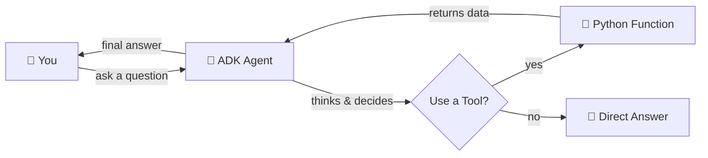
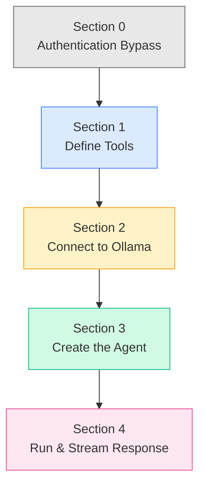
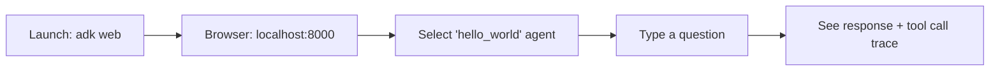
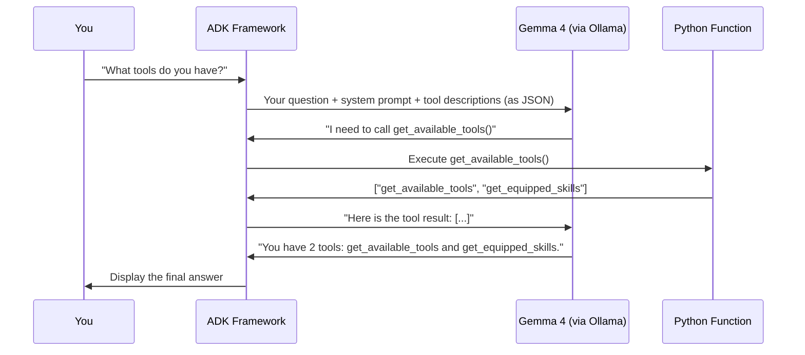
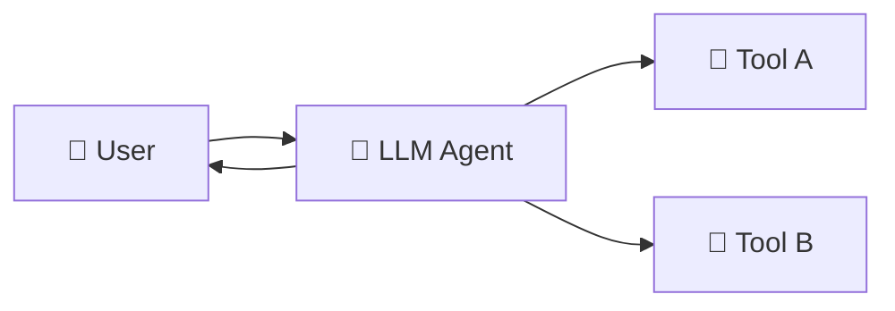
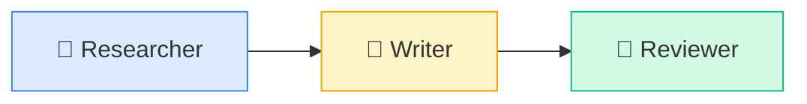
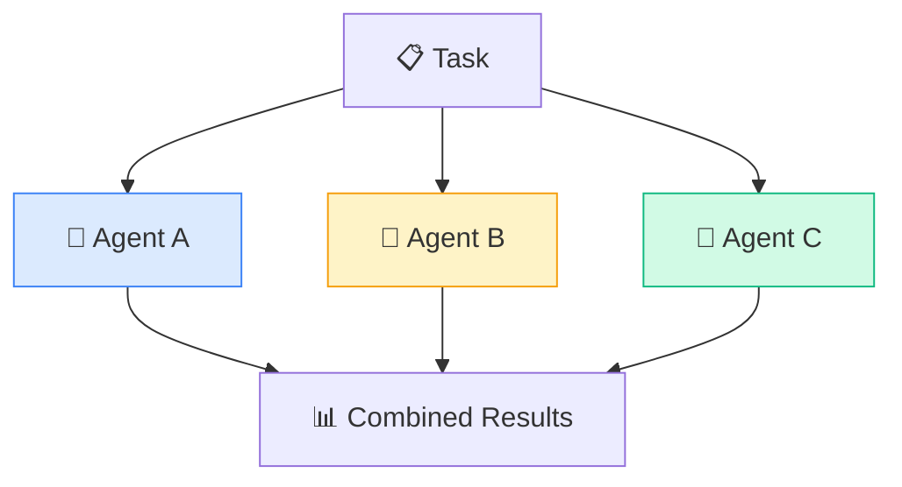
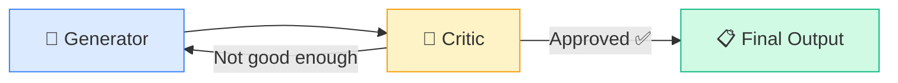
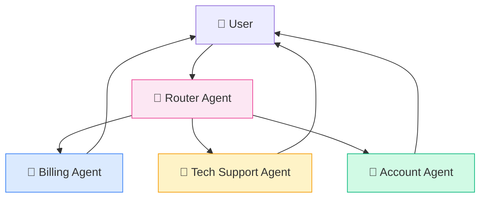

# Building Your First Local AI Agent with Google ADK and Gemma 4

> **A beginner-friendly, step-by-step tutorial for running an AI agent entirely on your own computer — no cloud, no API keys, no monthly bills.**

---

## Table of Contents

1. [What Are We Building?](#1-what-are-we-building)
2. [Key Concepts in Plain English](#2-key-concepts-in-plain-english)
3. [Prerequisites](#3-prerequisites)
4. [Environment Setup](#4-environment-setup)
   - [Step 1: Install Ollama](#step-1-install-ollama)
   - [Step 2: Pull and Customize a Model](#step-2-pull-and-customize-a-model)
   - [Step 3: Create a Python Environment](#step-3-create-a-python-environment)
5. [Hello World Tutorial: Build a System Chatbot Agent](#5-hello-world-tutorial-build-a-system-chatbot-agent)
   - [Project Scaffold](#51-project-scaffold)
   - [Code Walkthrough](#52-code-walkthrough)
   - [Running the Agent from the Terminal](#53-running-the-agent-from-the-terminal)
   - [Running the Agent with ADK Web](#54-running-the-agent-with-adk-web)
6. [Understanding the ADK Project Structure](#6-understanding-the-adk-project-structure)
7. [How It All Works Together: The Agent Execution Flow](#7-how-it-all-works-together-the-agent-execution-flow)
8. [Agentic Workflow Design Patterns](#8-agentic-workflow-design-patterns)
   - [Pattern 1: LLM Agent (Single Agent)](#pattern-1-llm-agent-single-agent)
   - [Pattern 2: Sequential Agent](#pattern-2-sequential-agent)
   - [Pattern 3: Parallel Agent](#pattern-3-parallel-agent)
   - [Pattern 4: Loop Agent](#pattern-4-loop-agent)
   - [Pattern 5: Multi-Agent System (Agent Team)](#pattern-5-multi-agent-system-agent-team)
   - [Choosing the Right Pattern](#choosing-the-right-pattern)
9. [Troubleshooting Common Issues](#9-troubleshooting-common-issues)
10. [Further Reading and Resources](#10-further-reading-and-resources)

---

## 1. What Are We Building?

In this tutorial, you will build a **local AI agent** — a small program powered by an AI brain that can think, make decisions, and take actions using tools you define.

Here is what makes this special:

- **Everything runs on your computer.** No internet needed after setup. No cloud bills.
- **The AI brain is Gemma 4**, Google DeepMind's open model, running through **Ollama**.
- **The framework is Google ADK** (Agent Development Kit), Google's official toolkit for building AI agents.
- **The agent you build** is a system chatbot that can inspect its own tools and skills — like a robot that knows what its own hands can do.



---

## 2. Key Concepts in Plain English

Before we start coding, let's define a few terms. Think of them as characters in a story.

| Concept | What It Is | Analogy |
|:---|:---|:---|
| **Agent** | A program that receives a goal, thinks about it, and takes actions to achieve it. | A new employee who reads instructions and uses office tools to get work done. |
| **LLM (Large Language Model)** | The AI "brain" inside the agent. It understands language and generates text. | The employee's brain — it reasons, plans, and writes. |
| **Tool** | A Python function that the agent can call to interact with the real world. | The employee's hands — checking a database, reading a file, or sending an email. |
| **Ollama** | A free application that downloads and runs AI models locally on your machine. | A personal server rack sitting under your desk. |
| **Gemma 4** | A family of open AI models built by Google DeepMind, optimized for reasoning and tool use. | The specific type of brain you install into your agent. |
| **ADK** | Google's Agent Development Kit — the framework that wires the brain, tools, and conversations together. | The office building: it provides the rooms, hallways, and phone lines. |
| **Session** | A single conversation thread. The agent remembers what was said earlier in the same session. | One phone call. Everything said during the call is remembered. |
| **Inference** | The process of an AI model generating a response. | The employee thinking and then writing a reply. |
| **Quantization** | Compressing a model to use less memory, with minimal quality loss. | Shrinking a large textbook into a pocket-sized edition that covers the same material. |

---

## 3. Prerequisites

You need the following before starting:

| Requirement | Details |
|:---|:---|
| **Computer** | macOS with Apple Silicon (M1, M2, M3, M4) and at least 16 GB RAM. 32 GB recommended for the 26B model. |
| **Python** | Version 3.9 or higher. Check with `python3 --version`. |
| **Terminal** | The built-in macOS Terminal app (or any terminal emulator). |
| **Ollama** | We will install this in Step 1. |
| **Basic comfort with the terminal** | You should know how to open it and type commands. This guide will tell you exactly what to type. |

---

## 4. Environment Setup

### Step 1: Install Ollama

Ollama is the application that runs AI models on your computer. Think of it as a local, private ChatGPT server that only you can access.

1. Go to [ollama.com](https://ollama.com) and download the macOS installer.
2. Run the installer. It will place Ollama in your Applications folder.
3. Open your **Terminal** and start the Ollama background process:

```bash
ollama serve
```

> **Note:** This command keeps running. Open a **second Terminal window** for the next steps. Ollama must be running in the background whenever you use your agent.

### Step 2: Pull and Customize a Model

Now we download the AI brain. For computers with **32 GB RAM**, we recommend:

```bash
ollama pull gemma4:26b
```

> This download is about 15–18 GB. It may take a while depending on your internet speed.

For computers with **16 GB RAM**, use the smaller model instead:

```bash
ollama pull gemma4:4b
```

#### Recommended: Model Selection Guide

| Your RAM | Recommended Model | Download Size | Best For |
|:---|:---|:---|:---|
| 32 GB | `gemma4:26b` | ~15 GB | Complex reasoning, multi-step tool use |
| 16 GB | `gemma4:4b` | ~3 GB | Simple tasks, fast responses |

#### Create a Custom Model Profile (Optional but Recommended)

This step creates a tuned version of the model with a larger memory and more focused behavior:

```bash
cat << 'EOF' > Modelfile
FROM gemma4:26b
PARAMETER num_ctx 8192
PARAMETER temperature 0.2
EOF
```

```bash
ollama create gemma4-agent -f Modelfile
```

**What do these settings do?**

| Parameter | What It Controls | Our Value | Why |
|:---|:---|:---|:---|
| `num_ctx` | How many words the agent can "remember" in one conversation | 8192 | Agents need long memory to process tool outputs |
| `temperature` | How creative vs. focused the responses are (0 = robotic, 1 = creative) | 0.2 | Agents need precise, predictable answers for tool calling |

Verify your model is ready:

```bash
ollama list
```

You should see `gemma4-agent` (or `gemma4:26b`) in the list.

### Step 3: Create a Python Environment

A Python virtual environment is like a clean, isolated workspace. It prevents package conflicts with other projects on your machine.

1. Navigate to your project directory:

```bash
cd /path/to/your/project
```

2. Create the virtual environment:

```bash
python3 -m venv .venv
```

3. Activate it (you must do this every time you open a new terminal):

```bash
source .venv/bin/activate
```

> **Tip:** You will see `(.venv)` appear at the beginning of your terminal prompt. This confirms the environment is active.

4. Install the required packages:

```bash
pip install google-adk litellm
```

| Package | What It Does |
|:---|:---|
| `google-adk` | The Agent Development Kit framework. Provides the `Agent`, `AdkApp`, and CLI tools (`adk web`, `adk run`). |
| `litellm` | A translation bridge that lets ADK talk to Ollama's local server as if it were a cloud API. |

5. Create a `.env` file in your project root to store configuration:

```bash
echo 'OLLAMA_API_BASE="http://localhost:11434"' > .env
```

---

## 5. Hello World Tutorial: Build a System Chatbot Agent

We are going to build a chatbot agent that can tell you about its own capabilities — what tools it has and what skills are equipped. Think of it as a robot that can look at its own hands and describe them.

### 5.1 Project Scaffold

The ADK provides a built-in command to create a properly structured agent project. Run this from your project root:

```bash
adk create hello_world
```

When prompted, choose **option 2** ("Other models") since we are using a local Ollama model.

This creates the following folder:

```
hello_world/
├── __init__.py    # Makes this folder a Python package
├── agent.py       # Where your agent logic lives
└── .env           # Environment variables (empty by default)
```

### 5.2 Code Walkthrough

Open `hello_world/agent.py` and replace its contents with the following code. Each section is explained in detail below.

```python
import os
import asyncio
from google.adk.agents import Agent
from google.adk.models.lite_llm import LiteLlm  
from vertexai.agent_engines import AdkApp
from google.auth.credentials import AnonymousCredentials
import vertexai

# =====================================================================
# Section 0: Authentication Bypass (Local-Only Fix)
# =====================================================================
# The ADK tries to connect to Google Cloud by default.
# Since we are running 100% locally, we give it "dummy" credentials
# so it does not throw an authentication error.
vertexai.init(
    project="local-dummy-project",
    location="us-central1",
    credentials=AnonymousCredentials()
)

# =====================================================================
# Section 1: Define Tools (What the Agent Can Do)
# =====================================================================
# Tools are regular Python functions. The agent reads the docstring
# (the text inside triple quotes) to understand what each tool does.
# Think of tools as the agent's hands.

def get_available_tools() -> list:
    """
    Checks the agent system to return a list of all currently
    available tools the agent can use.
    
    Returns:
        A list of string names for the tools.
    """
    print("\n[Executing Tool] Checking available tools...")
    return ["get_available_tools", "get_equipped_skills"]

def get_equipped_skills() -> list:
    """
    Checks the local project structure to return a list of all
    skills equipped to the system.
    
    Returns:
        A list of string names for the skills equipped.
    """
    print("\n[Executing Tool] Checking equipped skills...")
    project_root = os.path.dirname(os.path.dirname(os.path.abspath(__file__)))
    skills_dir = os.path.join(project_root, "skills")
    
    if os.path.exists(skills_dir) and os.path.isdir(skills_dir):
        skills = [
            d for d in os.listdir(skills_dir)
            if os.path.isdir(os.path.join(skills_dir, d))
        ]
        if skills:
            return skills
            
    return ["No skills currently equipped."]

# =====================================================================
# Section 2: Connect to the Local Model
# =====================================================================
# LiteLlm acts as a bridge between ADK and Ollama.
# The "ollama_chat/" prefix is important — it tells LiteLlm to use
# Ollama's chat-compatible endpoint, which supports tool calling.
local_model = LiteLlm(model="ollama_chat/gemma4-agent")  

# =====================================================================
# Section 3: Create the Agent
# =====================================================================
# This is where everything comes together.
# - model:       The AI brain (Gemma 4 via Ollama)
# - name:        A unique identifier for this agent
# - description: A short summary (used by multi-agent systems)
# - instruction: The system prompt — tells the agent how to behave
# - tools:       The list of Python functions it can call
root_agent = Agent(
    model=local_model,
    name="system_chatbot_agent",
    description=(
        "A chatbot that helps users understand the current agent system, "
        "available tools, and equipped skills."
    ),
    instruction=(
        "You are a helpful system agent assistant. "
        "Your primary job is to inform the user about the system's capabilities. "
        "When asked about available tools, you must use the get_available_tools "
        "tool to list them. "
        "When asked about equipped skills, you must use the get_equipped_skills "
        "tool to list them. "
        "Answer questions clearly and concisely."
    ),
    tools=[get_available_tools, get_equipped_skills]
)

# =====================================================================
# Section 4: Run the Agent (Terminal Mode)
# =====================================================================
app = AdkApp(agent=root_agent)

async def main():
    user_id = "macbook_admin_01"
    print("--- ADK Local System Chatbot Initialized successfully ---")
    
    # Create a conversation session
    session = await app.async_create_session(user_id=user_id)
    session_id = session.id
    
    user_prompt = "What tools and skills do you have available?"
    print(f"\nUser: {user_prompt}")
    
    # Send the question and stream the response
    response_stream = app.async_stream_query(
        user_id=user_id,
        session_id=session_id,
        message=user_prompt
    )
    
    print("\nAgent Response: ", end="")
    async for chunk in response_stream:
        if "content" in chunk and "text" in chunk["content"]:
            print(chunk["content"]["text"], end="", flush=True)
    print("\n")

if __name__ == "__main__":
    os.environ["OLLAMA_API_BASE"] = "http://localhost:11434"
    asyncio.run(main())
```

#### What Each Section Does



| Section | Purpose | Why It's Needed |
|:---|:---|:---|
| **Section 0** | Bypass Google Cloud auth | ADK defaults to expecting Cloud credentials. We give it "dummy" ones for local use. |
| **Section 1** | Define Python functions as tools | The agent reads docstrings to understand each tool. Without tools, the agent can only talk — it cannot act. |
| **Section 2** | Connect ADK to Ollama via LiteLlm | The `ollama_chat/` prefix ensures the correct API endpoint is used. Using just `ollama/` can cause an infinite tool-calling loop. |
| **Section 3** | Wire everything into an `Agent` object | The `instruction` field is the system prompt — it shapes the agent's personality and behavior. |
| **Section 4** | Create a session and stream the response | `async_stream_query` returns chunks of text as the model generates them, giving a "typing" effect. |

### 5.3 Running the Agent from the Terminal

Make sure Ollama is running (`ollama serve` in another terminal), then:

```bash
source .venv/bin/activate
python hello_world/agent.py
```

#### Expected Output

```
--- ADK Local System Chatbot Initialized successfully ---

User: What tools and skills do you have available?

[Executing Tool] Checking available tools...
[Executing Tool] Checking equipped skills...

Agent Response: I have the following tools available:
- get_available_tools
- get_equipped_skills

Currently, no skills are equipped to the system.
```

> **What just happened?** The agent received your question, decided it needed to call two tools, executed the Python functions, read the results, and composed a natural language summary.

### 5.4 Running the Agent with ADK Web

The ADK includes a built-in web interface for visually chatting with and debugging your agent. This is the recommended way to develop and test agents.

**Launch the web interface:**

```bash
adk web
```

**Then open your browser to:** `http://localhost:8000`

#### What You Can Do in ADK Web

| Feature | Description |
|:---|:---|
| **Agent Selector** | Choose which agent to chat with from a dropdown menu (top of the page). |
| **Chat Interface** | Type messages and see the agent's responses in real-time. |
| **Tool Call Inspector** | View the exact JSON requests the agent made to each tool, and the data that was returned. |
| **Event Trace** | See every step the agent took: thinking, tool calls, receiving results, composing answers. |



> **Tip:** The ADK Web UI is especially useful when your agent is making unexpected decisions. The event trace shows you *exactly* why the agent called a certain tool or gave a certain answer.

---

## 6. Understanding the ADK Project Structure

ADK uses a specific folder structure so that the `adk web` and `adk run` commands can automatically discover your agents.

### This Project's Structure

```
JPTranscriptADK/                  ← Project root
├── .env                          ← Root environment variables
├── .venv/                        ← Python virtual environment (not committed to git)
├── README.md                     ← This file
│
└── hello_world/                  ← Your agent package
    ├── __init__.py               ← Makes this folder importable (required by ADK)
    ├── agent.py                  ← Agent definition, tools, and logic
    └── .env                      ← Agent-specific environment variables
```

### File-by-File Explanation

| File | Required? | Purpose |
|:---|:---|:---|
| `hello_world/__init__.py` | **Yes** | Contains `from . import agent`. This tells Python (and ADK) to load `agent.py` when the package is imported. Without this file, `adk web` cannot find your agent. |
| `hello_world/agent.py` | **Yes** | The core file. Must define a variable called `root_agent` (or the agent specified in your config). This is where you define the agent, its tools, and its system prompt. |
| `hello_world/.env` | Optional | Agent-specific environment variables. For example, API keys or model names that only this agent uses. |
| `.env` (root) | Optional | Project-wide environment variables shared across all agents. Good for `OLLAMA_API_BASE`. |
| `.venv/` | Recommended | Your isolated Python environment. Created by `python3 -m venv .venv`. |

### Scaling Up: A Multi-Agent Project

As your project grows, you can add more agent packages side by side. Each one appears as a separate option in `adk web`:

```
my_project/
├── .env
├── .venv/
│
├── hello_world/              ← Agent 1: System chatbot
│   ├── __init__.py
│   ├── agent.py
│   └── .env
│
├── research_agent/           ← Agent 2: Web researcher
│   ├── __init__.py
│   ├── agent.py
│   └── .env
│
└── code_reviewer/            ← Agent 3: Code analysis
    ├── __init__.py
    ├── agent.py
    └── .env
```

### The Naming Rule

The ADK enforces one critical naming convention:

> **The variable holding your main agent in `agent.py` must be named `root_agent`.**

If you name it anything else (like `my_agent` or `main_agent`), the `adk web` and `adk run` commands will not be able to find it.

---

## 7. How It All Works Together: The Agent Execution Flow

When you send a message to the agent, a multi-step process happens behind the scenes. Understanding this flow is key to debugging and improving your agents.



### Step-by-Step Breakdown

| Step | What Happens | Who Does It |
|:---|:---|:---|
| 1 | You type a question | You |
| 2 | ADK packages your question with the system prompt and a JSON description of all available tools | ADK Framework |
| 3 | The LLM reads everything and decides whether it needs to call a tool | Gemma 4 |
| 4 | If yes, the LLM outputs a structured "tool call" request (not a text answer) | Gemma 4 |
| 5 | ADK intercepts the tool call, pauses the LLM, and runs your Python function | ADK Framework |
| 6 | The function returns data (a list, a dictionary, a string, etc.) | Your Python Code |
| 7 | ADK sends the function result back to the LLM | ADK Framework |
| 8 | The LLM reads the result and composes a final, natural-language answer | Gemma 4 |
| 9 | ADK streams the answer back to you | ADK Framework |

---

## 8. Agentic Workflow Design Patterns

As your applications become more complex, a single agent may not be enough. The Google ADK provides built-in primitives for organizing multiple agents into powerful workflows. Think of these as blueprints for building different types of teams.

### Pattern 1: LLM Agent (Single Agent)

**What it is:** One agent with one brain and one or more tools. This is what our Hello World example uses.

**When to use it:** Simple, focused tasks where one agent can handle the entire job.



**Example:**

```python
root_agent = Agent(
    model=local_model,
    name="weather_agent",
    instruction="You help users check the weather.",
    tools=[get_weather, get_forecast]
)
```

---

### Pattern 2: Sequential Agent

**What it is:** An assembly line. Multiple agents execute one after another, in a fixed order. Each agent's output becomes the next agent's input.

**When to use it:** Multi-step workflows where order matters — like "first research, then write, then review."



**Example:**

```python
from google.adk.agents import SequentialAgent

pipeline = SequentialAgent(
    name="content_pipeline",
    sub_agents=[researcher_agent, writer_agent, reviewer_agent]
)
```

**How it works:**
1. The `researcher_agent` runs first and saves its findings to shared state.
2. The `writer_agent` reads the findings and drafts an article.
3. The `reviewer_agent` checks the draft and suggests improvements.

---

### Pattern 3: Parallel Agent

**What it is:** A fan-out pattern. Multiple agents work at the same time on independent tasks, and their results are gathered together at the end.

**When to use it:** Tasks that can be done independently and simultaneously — like checking multiple data sources at once to save time.



**Example:**

```python
from google.adk.agents import ParallelAgent

parallel_check = ParallelAgent(
    name="multi_source_checker",
    sub_agents=[database_agent, api_agent, file_system_agent]
)
```

---

### Pattern 4: Loop Agent

**What it is:** An iterative refinement cycle. An agent generates output, another agent critiques it, and the cycle repeats until the result meets a quality threshold.

**When to use it:** Tasks where quality improves through iteration — like writing code, then testing it, then fixing bugs, and repeating.



**Example:**

```python
from google.adk.agents import LoopAgent

refiner = LoopAgent(
    name="code_refiner",
    sub_agents=[code_writer_agent, code_tester_agent],
    max_iterations=5  # Safety limit to prevent infinite loops
)
```

---

### Pattern 5: Multi-Agent System (Agent Team)

**What it is:** A coordinator agent that analyzes incoming tasks and delegates them to the right specialist agent. Think of it as a manager who assigns work to their team.

**When to use it:** Complex, multi-domain tasks where different agents have different expertise — like a customer support system that routes billing questions to a billing agent and technical questions to a tech agent.



**Example:**

```python
root_agent = Agent(
    model=local_model,
    name="support_router",
    instruction=(
        "You are a customer support router. "
        "Analyze the user's question and delegate it to the appropriate specialist."
    ),
    sub_agents=[billing_agent, tech_agent, account_agent]
)
```

---

### Choosing the Right Pattern

| Pattern | Best For | Complexity | Example Use Case |
|:---|:---|:---|:---|
| **LLM Agent** | Single-purpose tasks | ⭐ Low | A chatbot that answers FAQ questions |
| **Sequential** | Ordered multi-step workflows | ⭐⭐ Medium | Research → Write → Edit pipeline |
| **Parallel** | Independent, concurrent tasks | ⭐⭐ Medium | Check 5 data sources simultaneously |
| **Loop** | Iterative quality improvement | ⭐⭐ Medium | Generate code → Test → Fix → Repeat |
| **Multi-Agent** | Complex, multi-domain routing | ⭐⭐⭐ High | Customer support with specialized departments |

> **Tip:** You can combine patterns. For example, a Multi-Agent router might delegate to a Sequential pipeline, which itself contains a Loop agent for quality refinement. These composable building blocks are what make ADK powerful.

---

## 9. Troubleshooting Common Issues

### Issue: `GoogleAuthError` on startup

**Symptom:** The agent crashes with an authentication error before it even runs.

**Cause:** The ADK's `AdkApp` wrapper triggers Vertex AI initialization, which expects Google Cloud credentials.

**Fix:** Add the authentication bypass at the top of your `agent.py` (Section 0 in our code):

```python
from google.auth.credentials import AnonymousCredentials
import vertexai

vertexai.init(
    project="local-dummy-project",
    location="us-central1",
    credentials=AnonymousCredentials()
)
```

---

### Issue: Agent enters an infinite tool-calling loop

**Symptom:** The agent calls the same tool over and over, never giving a final answer.

**Cause:** Using the `ollama/` prefix instead of `ollama_chat/` when configuring LiteLlm.

**Fix:** Always use the `ollama_chat/` prefix:

```python
# ❌ Wrong — can cause infinite loops
local_model = LiteLlm(model="ollama/gemma4-agent")

# ✅ Correct — uses the chat-compatible endpoint
local_model = LiteLlm(model="ollama_chat/gemma4-agent")
```

---

### Issue: `adk web` does not show my agent

**Symptom:** You launch `adk web` but your agent does not appear in the dropdown.

**Cause:** Missing `__init__.py` or the agent variable is not named `root_agent`.

**Fix:** Ensure your `hello_world/__init__.py` contains:

```python
from . import agent
```

And your `hello_world/agent.py` defines a variable named exactly `root_agent`:

```python
root_agent = Agent(...)
```

---

### Issue: Ollama is not responding

**Symptom:** Connection errors when running the agent.

**Fix:** Make sure Ollama is running in a separate terminal:

```bash
ollama serve
```

And verify the model is downloaded:

```bash
ollama list
```

---

## 10. Further Reading and Resources

| Resource | Link |
|:---|:---|
| **ADK Official Documentation** | [google.github.io/adk-docs](https://google.github.io/adk-docs/) |
| **ADK Python Quickstart** | [Quickstart Guide](https://google.github.io/adk-docs/get-started/python/) |
| **ADK Workflow Agents** | [Workflow Agents](https://google.github.io/adk-docs/agents/workflow-agents/) |
| **ADK Multi-Agent Systems** | [Multi-Agent Systems](https://google.github.io/adk-docs/agents/multi-agents/) |
| **ADK + Ollama Guide** | [Ollama Integration](https://google.github.io/adk-docs/agents/models/ollama/) |
| **ADK Custom Tools** | [Function Tools](https://google.github.io/adk-docs/tools-custom/function-tools/) |
| **ADK MCP Integration** | [MCP Tools](https://google.github.io/adk-docs/tools-custom/mcp-tools/) |
| **Ollama Model Library** | [ollama.com/library](https://ollama.com/library) |
| **Gemma 4 Model Card** | [ai.google.dev/gemma](https://ai.google.dev/gemma) |
| **ADK GitHub Repository** | [github.com/google/adk-python](https://github.com/google/adk-python) |

---

*Built with [Google Agent Development Kit (ADK)](https://google.github.io/adk-docs/) and [Gemma 4](https://ai.google.dev/gemma) running locally via [Ollama](https://ollama.com).*
