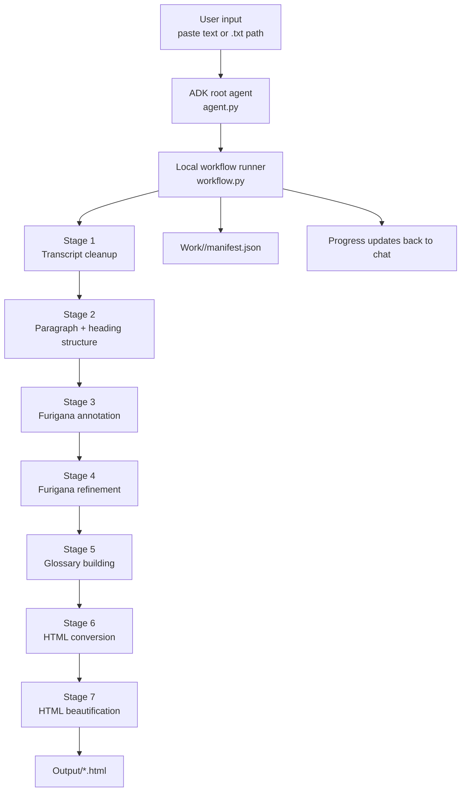
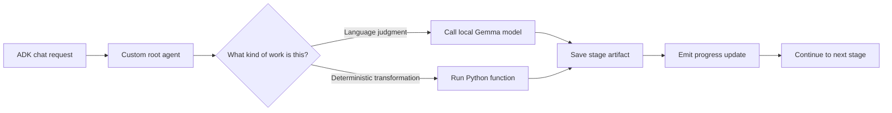

# JPTranscript_app

> **A beginner-friendly example of how to build a practical AI application with Google ADK and a local Ollama model.**
>
> This project turns long Japanese transcript text into a clean, learner-friendly HTML study document with section headings, furigana, a glossary, and readable styling.

---

## 1. What This App Is For

`jptranscript_app` is a teaching example and a working product at the same time.

It shows how to build an AI application that:

- runs locally on your own computer
- uses **Google ADK** as the application framework
- uses **Ollama + Gemma 4** as the local language model
- keeps long content out of the chat session state
- combines **AI steps** and **Python tool steps** in one reliable workflow

In plain English:

- the model helps where language judgment is useful
- Python tools handle the parts that should be deterministic and safe
- the app saves big intermediate files to disk so long Japanese text does not overwhelm the local model

---

## 2. Core Idea

Most small ADK demos keep everything inside the chat conversation.

That works for tiny examples, but it becomes fragile when you try to process a long Japanese transcript with a local model. The transcript, the cleaned version, the structured markdown, the furigana version, the glossary version, and the final HTML can easily become too large to keep sending back into the model again and again.

This app solves that problem with a **file-backed workflow**:

1. the user pastes text or gives a `.txt` file path
2. the root ADK agent starts a local pipeline
3. each stage writes its output to the `Work/` folder
4. only small progress messages are sent back to the ADK chat
5. the final HTML file is saved to the `Output/` folder



---

## 3. Workflow Overview

The current workflow has seven stages:

| Stage | What It Does | Why It Exists |
|:---|:---|:---|
| 1. Optimization | Cleans raw transcript noise, keeps timestamps, repairs unnatural spacing | Raw transcripts often contain OCR-like spacing and filler noise |
| 2. Paragraph Structuring | Adds section structure, headings, and a table of contents | Learners need clear chunks instead of one giant wall of text |
| 3. Furigana Annotation | Adds furigana to kanji-heavy text | Makes difficult words readable |
| 4. Furigana Refinement | Removes over-annotation from common or repeated words | Keeps the page readable instead of visually crowded |
| 5. Glossary Building | Marks difficult expressions and builds explanations | Helps learners understand vocabulary and grammar in context |
| 6. HTML Conversion | Converts markdown-like text into semantic HTML | Prepares the content for browser display |
| 7. Beautification | Applies the visual template and saves the file | Produces the final study document users actually read |

---

## 4. How The Agentic Design Works

This app uses an **agentic workflow**, but not in the “one giant agent does everything” style.

Instead, it uses a pattern that is safer for long documents:

- **ADK root agent**: receives the user request, streams progress, returns the final summary
- **workflow runner**: coordinates all stages and saves artifacts to disk
- **local model calls**: used only for the stages that benefit from language judgment
- **Python tools/functions**: used for deterministic work like furigana cleanup, HTML generation, validation, and file saving

### Why this matters

If every step were handled by a single ADK `LlmAgent`, the model would keep re-reading the entire growing document at every stage. That is expensive, slow, and fragile on a local machine.

This app avoids that by treating the model as one component in the system, not the whole system.



---

## 5. Where Tool Use Happens

The easiest way to understand this app is to ask: “Which parts are AI, and which parts are normal code?”

| Step | Main Driver | Tool / Function Role |
|:---|:---|:---|
| Transcript cleanup | Local model + deterministic cleanup | The model removes filler/noise, then Python fixes spacing safely |
| Paragraph structure | Local model + deterministic heading repair | The model proposes structure, then Python repairs titles/TOC |
| Furigana annotation | Python | `fugashi` adds readings deterministically |
| Furigana refinement | Python | Repeated/common furigana is reduced deterministically |
| Glossary building | Local model + Python merging | The model explains terms, Python renumbers and validates entries |
| HTML conversion | Python | Markdown-like structure becomes HTML |
| Beautification | Python | CSS is applied and the file is saved |

This is an important lesson for building AI applications:

- use the model for judgment, rewriting, or language-heavy interpretation
- use code for structure, validation, formatting, and file operations

---

## 6. Project File Structure

Here is the current app structure in a simplified form:

```text
jptranscript_app/
├── README.md
├── AGENTS.md
├── implementation.md
├── __init__.py
├── agent.py
├── workflow.py
├── .env
├── sample.txt
├── prompts/
├── tools/
├── templates/
├── tests/
├── Output/
└── Work/
```

### File-by-file guide

| Path | Purpose | Beginner-friendly explanation |
|:---|:---|:---|
| `agent.py` | ADK entrypoint | The “front desk” of the app. It receives the request, streams progress to chat, and reports the result. |
| `workflow.py` | Main workflow coordinator | The “project manager.” It decides the order of the seven stages and saves each stage output. |
| `tools/text_processing.py` | Core text utilities | Shared helpers for chunking, validation, input resolution, timestamps, filenames, and safe spacing cleanup. |
| `tools/furigana_tools.py` | Furigana logic | Adds and refines furigana using Japanese text analysis tools. |
| `tools/html_converter.py` | HTML rendering | Turns the structured study text into a browser-ready HTML document. |
| `tools/beautifier_tools.py` | Styling helper | Applies the CSS template to make the output readable and attractive. |
| `prompts/optimization.md` | Stage 1 prompt | Tells the model how to clean a raw transcript safely. |
| `prompts/paragraph.md` | Stage 2 prompt | Tells the model how to add structure without rewriting meaning. |
| `prompts/glossary.md` | Stage 5 prompt | Tells the model how to annotate difficult terms and explain them. |
| `prompts/furigana_review.md` | Review prompt | Supporting instruction text for furigana-related checks. |
| `templates/default_style.css` | Output design template | The visual style that final HTML files use. |
| `tests/` | Automated tests | Small checks that help confirm the workflow still works after code changes. |
| `Output/` | Final user-facing HTML files | This is where the finished study documents are saved. |
| `Work/` | Temporary per-run stage artifacts | This stores intermediate files for one job, which is useful for debugging and resumability. |
| `implementation.md` | Product requirement document | The long-form design and development plan for the app. |
| `AGENTS.md` | Project-specific working rules | Notes for how this repository expects transcript tasks to be handled. |
| `sample.txt` | Example input | A simple transcript file you can use for testing or learning. |

---

## 7. Why There Is Both `agent.py` And `workflow.py`

This is one of the most important design choices in the project.

### `agent.py`

`agent.py` is responsible for:

- talking to ADK
- receiving the user’s message
- turning pipeline progress into chat updates
- returning a short final success or failure message

### `workflow.py`

`workflow.py` is responsible for:

- running the actual processing stages
- calling the local model where needed
- saving intermediate artifacts
- validating outputs
- choosing safe fallback behavior

In other words:

- `agent.py` manages the **conversation**
- `workflow.py` manages the **work**

This split makes the app easier to understand, easier to debug, and much safer for long local runs.

---

## 8. How A Single Request Moves Through The System

Let’s say the user pastes this:

```text
0:08
皆 さ ん こ ん に ち は。
今 日 は 絵 に 関 す る 日 本 語 を ご 紹 介 し ま す。
```

Here is what happens:

1. `agent.py` receives the message from ADK.
2. It calls `run_transcript_pipeline(...)` in `workflow.py`.
3. Stage 1 cleans the transcript.
4. A deterministic spacing repair removes character-by-character gaps like `皆 さ ん`.
5. Stage 2 adds headings and a table of contents.
6. Stage 3 and Stage 4 add and refine furigana.
7. Stage 5 creates glossary markers and explanations.
8. Stage 6 builds HTML.
9. Stage 7 applies the CSS template and writes the final file.
10. `agent.py` sends the final file path back to the chat.

Meanwhile, progress updates such as:

- `Optimization started`
- `Paragraph chunk 2/4 completed`
- `Glossary building completed`

are streamed back into the ADK chat interface so the user can see that the app is working.

---

## 9. Running The App

From the repository root:

```bash
source .venv/bin/activate
adk web .
```

Then open the web interface and choose `jptranscript_app`.

You can give the app either:

- pasted Japanese transcript text
- or a relative `.txt` path such as `jptranscript_app/sample.txt`

The final HTML file will be written to:

```text
jptranscript_app/Output/
```

Intermediate files for that run will be written to:

```text
jptranscript_app/Work/<job-id>/
```

---

## 10. What To Look At When Debugging

If something looks wrong, these files are the most useful places to inspect:

| If You Want To Check... | Look Here |
|:---|:---|
| What the raw input looked like | `Work/<job-id>/stage0_raw.txt` |
| Whether transcript cleanup worked | `Work/<job-id>/stage1_optimized.txt` |
| Whether headings and TOC look sensible | `Work/<job-id>/stage2_structured.md` |
| Whether furigana looks too heavy or too sparse | `Work/<job-id>/stage3_furigana.txt` and `stage4_refined.txt` |
| Whether glossary numbering is correct | `Work/<job-id>/stage5_glossary.md` |
| Whether HTML conversion or styling is wrong | `stage6_output.html`, `stage7_output.html`, and `templates/default_style.css` |
| Whether a stage failed | `Work/<job-id>/manifest.json` |

---

## 11. What This Project Teaches About Building AI Apps

This app is a good learning example because it demonstrates several practical lessons:

### Lesson 1: Do not put everything in the chat state

Long documents should usually live on disk, not inside the live model conversation.

### Lesson 2: AI should not do everything

Some tasks are better handled by code:

- validation
- numbering
- file saving
- HTML rendering
- safe cleanup rules

### Lesson 3: Progress feedback matters

A working app can still feel broken if the user sees nothing during processing. Streaming progress updates is part of good product design, not just a technical extra.

### Lesson 4: Local models need careful workflow design

When you are not using a large cloud model, you must be more careful about:

- context size
- chunking
- retries
- deterministic repair steps
- resumability and artifacts

---

## 12. Which Files Are Safe To Ignore

These folders are created by running the app:

| Path | Keep Or Ignore? | Why |
|:---|:---|:---|
| `Output/` | Keep if you want the final files | These are the finished HTML documents |
| `Work/` | Usually safe to delete between runs | These are intermediate build artifacts |
| `tests/` | Keep | These help confirm the app still works |
| `prompts/` | Keep | These shape the model’s behavior |
| `tools/` | Keep | These are core application logic |

---

## 13. If You Want To Build Your Own App Next

If you want to build your own ADK + local model project after reading this one, the simplest recipe is:

1. start with a tiny `agent.py`
2. move heavy processing into a separate workflow module
3. use Python functions for deterministic transformations
4. store large intermediate artifacts on disk
5. stream progress back to the user
6. add tests for each stage before adding more features

That pattern is exactly what `jptranscript_app` is trying to teach.

---

## 14. Related Reading

For a broader tutorial-style explanation of ADK, Ollama, and local model setup, see the repository-root README:

- [Repository README](/Users/nilcreator/Desktop/0_Projects/Nilcreation/PersonalApplications/ADKApplications/README.md)

For the product requirements and future roadmap, see:

- [implementation.md](/Users/nilcreator/Desktop/0_Projects/Nilcreation/PersonalApplications/ADKApplications/jptranscript_app/implementation.md)

