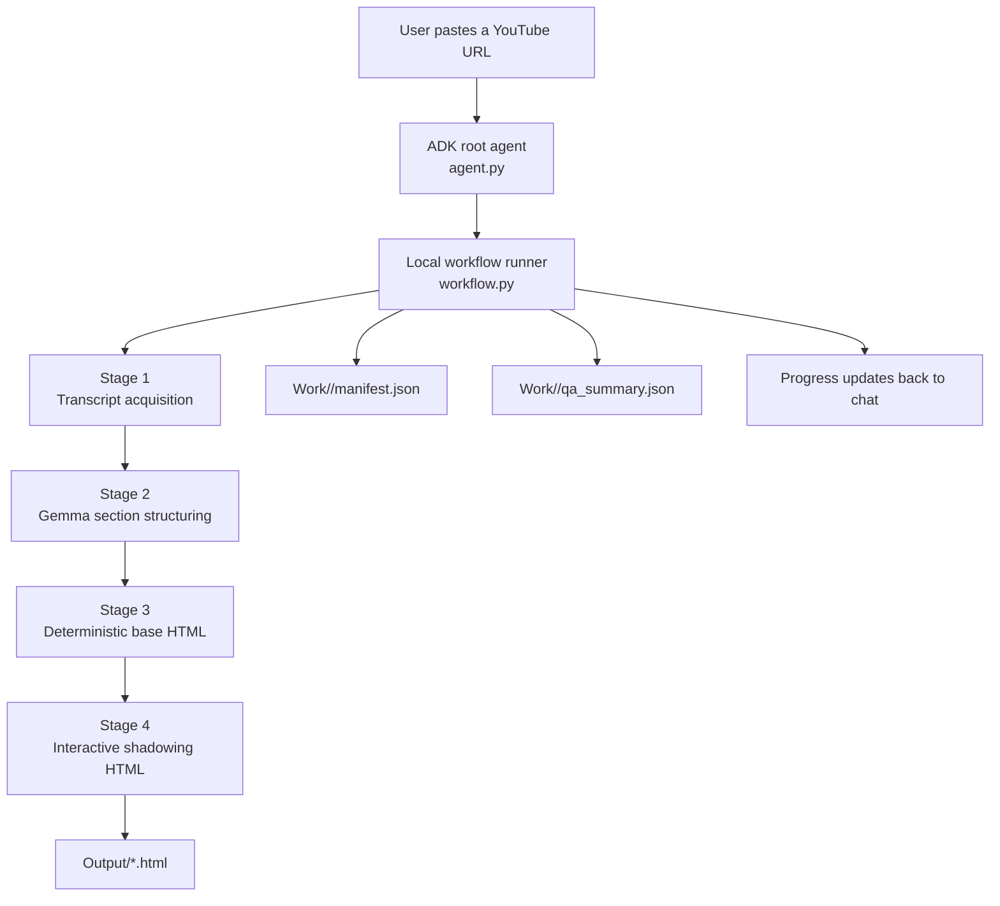

# yttranscript_app

> **A beginner-friendly example of how to build a practical local AI application with Google ADK, Ollama, and Gemma 4.**
>
> This app takes a YouTube link, builds a complete transcript, organizes it into study sections, and produces a polished shadowing HTML page that can be opened in a browser.

---

## 1. What This App Is For

`yttranscript_app` is both:

- a working local application
- a teaching example for how to build a reliable ADK workflow with local models

In plain English, the app does this:

1. the user pastes a YouTube link into the ADK web chat
2. the app extracts a complete timestamped transcript
3. Gemma 4 groups the transcript into study-friendly sections
4. Python tools turn that structured transcript into an interactive shadowing page
5. the final HTML file is saved locally

The design goal is not “let the model do everything.”

The design goal is:

- use the model where language judgment is useful
- use Python where reliability and validation matter
- keep large files on disk so local models do not get overwhelmed

---

## 2. Core Idea

Many AI demos keep everything inside one chat conversation.

That is fine for tiny examples, but it becomes fragile when you try to process a long video transcript locally. A full transcript, section structure, intermediate HTML, and final page can easily become too large to keep sending back into the model.

This app solves that problem with a **file-backed workflow**:

- the ADK agent stays lightweight
- the heavy work runs in `workflow.py`
- each stage writes an artifact into `Work/<job-id>/`
- only small progress messages are sent back to the chat
- the final deliverable is saved into `Output/`



---

## 3. What The Finished App Produces

The finished output is a single HTML page designed for shadowing practice.

The page includes:

- a header with the video title and source link
- a sticky player/control panel
- a takeaways section
- sectioned transcript blocks
- clickable time-synced cues
- active cue highlighting during playback
- clickable English words with dictionary lookup
- local preview guidance when YouTube blocks `file://` playback

The reference example for the expected experience is:

- `yttranscript_app/Output/ai-agent-design-patterns.html`

That file acts as the visual and structural contract for the runtime validator.

---

## 4. How One Request Moves Through The App

If a user enters a YouTube URL in the ADK web chat, this is what happens:

| Step | What Happens | Main Technology |
|:---|:---|:---|
| 1 | The ADK root agent reads the latest user message | Google ADK |
| 2 | The workflow extracts and normalizes the YouTube URL | Python |
| 3 | The transcript tool fetches metadata and subtitles with `yt-dlp`, then uses Whisper only if needed | `yt-dlp`, optional Whisper |
| 4 | Gemma 4 groups cues into contiguous study sections and proposes takeaways | Ollama + Gemma 4 |
| 5 | A deterministic renderer creates a stable intermediate HTML transcript | Python |
| 6 | A deterministic optimizer transforms that HTML into the final interactive shadowing page | Python + browser-safe HTML/JS |
| 7 | Validators check transcript integrity and output contract requirements | Python |
| 8 | The app saves a manifest, QA summary, and final HTML output | Python |

---

## 5. Agent Design Pattern

This app uses a **custom sequential orchestrator pattern with stage-level validation**.

That sounds technical, but the idea is simple:

- the work happens in a fixed order
- each stage has one clear job
- each stage saves its result before the next stage begins
- validators stop the pipeline if something important breaks

### Why this pattern was chosen

This project could have been written as:

- one giant agent prompt
- a multi-agent team
- a loop agent that keeps retrying everything

But that would be a poor fit for local transcript processing.

A better fit is:

- **one lightweight ADK root agent** for chat interaction
- **one workflow runner** for the actual work
- **small model calls only where needed**
- **deterministic tool calls for everything else**

### The pattern in plain English

| Layer | Role | Why It Exists |
|:---|:---|:---|
| `agent.py` | The front desk | Receives the chat request and streams progress back to the user |
| `workflow.py` | The project manager | Runs the stages in order and writes artifacts to disk |
| Ollama + Gemma 4 | The language specialist | Groups transcript cues into sections and creates takeaways |
| Python tools | The reliable workers | Handle transcript extraction, HTML rendering, validation, and file management |

### Where tool use happens

This project is a good example of **tool-augmented AI**, not “AI-only automation.”

| Stage | Model Use | Tool Use |
|:---|:---|:---|
| Transcript acquisition | No | `yt-dlp`, subtitle parsing, optional Whisper fallback |
| Transcript structuring | Yes | Gemma 4 returns section ranges and takeaways |
| Base HTML build | No | Deterministic Python HTML rendering |
| Final shadowing HTML | No | Deterministic Python transformation and browser-safe scripting |
| Validation | No | Contract checks, cue checks, transcript integrity checks |

### Why this matters for beginners

When people first build AI apps, they often try to make the model do everything.

That usually creates problems:

- outputs drift
- validation becomes difficult
- debugging becomes frustrating
- long inputs break local model limits

This project teaches a healthier pattern:

- let the model make language judgments
- let code enforce rules and structure

---

## 6. Project File Structure

Here is the app in a simplified tree:

```text
yttranscript_app/
├── README.md
├── AGENT.md
├── implementation.md
├── __init__.py
├── agent.py
├── workflow.py
├── Output/
├── Work/
├── prompts/
├── tools/
├── tests/
├── fixtures/
└── .agents/
```

### File-by-file guide

| Path | Purpose | Beginner-friendly explanation |
|:---|:---|:---|
| `README.md` | Project guide | The document you are reading now. |
| `agent.py` | ADK entrypoint | The part that talks to the ADK web chat. |
| `workflow.py` | Main workflow runner | The part that does the real work in ordered stages. |
| `__init__.py` | Package entry | Makes `yttranscript_app` discoverable as an ADK Python package. |
| `prompts/structure_transcript.md` | Structuring prompt | Instructions that tell Gemma 4 how to group transcript cues safely. |
| `tools/youtube_transcript.py` | Transcript acquisition | Extracts metadata, subtitles, and fallback ASR transcript artifacts. |
| `tools/transcript_structure.py` | Transcript chunking and structuring | Splits long transcripts into manageable cue chunks, validates section ranges, and creates fallback takeaways when needed. |
| `tools/html_renderer.py` | Deterministic base HTML renderer | Builds a stable transcript HTML file before the interactive layer is added. |
| `tools/shadowing_html.py` | Final HTML optimizer | Converts the base HTML into the final shadowing page with playback and dictionary features. |
| `tools/validate_transcript_integrity.py` | Transcript validator | Verifies that the structured transcript still preserves the original cue content. |
| `tools/validate_shadowing_html.py` | Output contract validator | Checks that the final HTML includes the required structure and interaction hooks. |
| `tools/ollama_client.py` | Local model client | Sends bounded requests to Ollama. |
| `tools/job_state.py` | Manifest and path helpers | Creates per-job folders and keeps output paths organized. |
| `tools/serve_shadowing_html.py` | Local preview helper | Lets you preview a generated HTML file over localhost instead of `file://`. |
| `tests/` | Automated checks | Small tests for the workflow, validators, and file-backed logic. |
| `fixtures/html_reference/ai-agent-design-patterns.html` | Contract fixture | Reference HTML used by the validator and tests. |
| `Output/` | Final deliverables | Stores the generated HTML pages that a user can open and study from. |
| `Work/` | Per-run artifacts | Stores manifest files, intermediate transcript files, and QA summaries for each run. |
| `implementation.md` | Design plan | The long-form implementation roadmap and architecture notes. |
| `AGENT.md` | Legacy workflow note | A record of the earlier skill-based workflow that inspired this app. |
| `.agents/` | Historical skill references | Old project-local skill definitions kept as reference material, not used by the current runtime. |

### The most important files to read first

If you are new to the codebase, read these in order:

1. `yttranscript_app/README.md`
2. `yttranscript_app/agent.py`
3. `yttranscript_app/workflow.py`
4. `yttranscript_app/tools/youtube_transcript.py`
5. `yttranscript_app/tools/transcript_structure.py`

---

## 7. How The Four Runtime Stages Work

### Stage 1. Transcript Acquisition

This stage:

- validates the YouTube URL
- loads metadata with `yt-dlp`
- chooses the best subtitle track
- downloads and parses subtitles
- falls back to Whisper only when necessary

Why it is mostly deterministic:

- transcript completeness is a hard requirement
- shell tools and parsers are more reliable than model-generated transcripts for this stage

### Stage 2. Transcript Structuring

This is the only stage where Gemma 4 is required for language judgment.

Gemma does **not** rewrite the transcript.

Instead, it only:

- groups cues into contiguous sections
- proposes takeaways

Python then validates:

- every cue is still covered
- section ranges are contiguous
- the full transcript is preserved

### Stage 3. Base HTML Rendering

This stage converts the structured transcript into predictable HTML.

That HTML is intentionally plain and stable so that the next stage receives a known, easy-to-parse structure.

### Stage 4. Final Shadowing HTML

This stage upgrades the base transcript HTML into the full interactive page.

It adds:

- YouTube embed support
- cue click-to-seek behavior
- active cue highlighting
- dictionary popup behavior
- responsive layout
- file-mode guidance for local previews

---

## 8. Why There Is Both `agent.py` And `workflow.py`

This split is one of the most important ideas in the project.

### `agent.py`

Handles:

- reading the user request
- starting the workflow
- streaming progress updates
- returning a short final success or failure message

### `workflow.py`

Handles:

- transcript extraction
- model calls
- HTML generation
- validators
- manifest writing
- QA summary writing
- final file output

In plain English:

- `agent.py` manages the conversation
- `workflow.py` manages the work

That separation keeps the ADK layer small and makes long local processing much easier to debug.

---

## 9. Running The App Locally

### Step 1. Create and activate a virtual environment

```bash
python3.12 -m venv .venv
source .venv/bin/activate
python -m pip install --upgrade pip
```

### Step 2. Install the project

```bash
python -m pip install -e .
```

If you want Whisper fallback support too:

```bash
python -m pip install -e '.[asr]'
```

### Step 3. Install local prerequisites

You need:

- Ollama running locally
- a Gemma-based model available in Ollama
- `yt-dlp`
- `ffmpeg` only if you want Whisper fallback

### Step 4. Start Ollama

```bash
ollama serve
```

In a second terminal, make sure your model exists:

```bash
ollama list
```

### Step 5. Launch the ADK web app

From the repository root:

```bash
adk web
```

Then choose `yttranscript_app`, paste a YouTube URL, and wait for the progress messages.

---

## 10. Common Questions

### Why does this app save files into `Work/`?

Because local models are better at processing bounded chunks than giant in-memory sessions. The `Work/` folder keeps the pipeline transparent and debuggable.

### Why are there validators?

Because transcript and HTML pipelines can fail in subtle ways. The validators catch problems early instead of letting the app quietly produce a broken page.

### Why is the final page mostly deterministic?

Because HTML layout, timestamps, cue wiring, and local playback behavior are much safer when they come from code instead of free-form generation.

### What is the role of Gemma 4 here?

Gemma 4 acts like a structuring assistant. It helps organize the transcript into sections and learning notes, but it is deliberately not trusted with the full page generation pipeline.

---

## 11. Relationship To Other Files In This Repository

This repository also contains:

- the root `README.md`, which teaches the broader ADK + Ollama setup
- `jptranscript_app`, a sister project for long Japanese text processing

If you want the bigger picture, read them in this order:

1. root `README.md`
2. `jptranscript_app/README.md`
3. `yttranscript_app/README.md`

That sequence moves from general concepts to two practical local ADK applications.

---

## 12. Final Takeaway

The most important lesson in `yttranscript_app` is not just “how to process a YouTube transcript.”

The real lesson is:

- keep the ADK agent small
- keep large artifacts on disk
- use local models only where judgment is needed
- validate every major stage
- let ordinary Python tools do the parts that should never be ambiguous

That pattern scales much better than a single giant prompt, especially when you are building on your own computer with local models.
